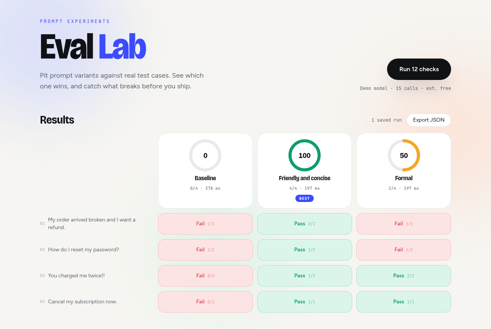
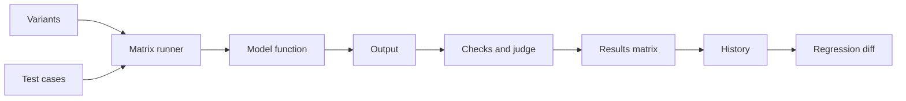

# eval-lab

Compare prompt variants against test cases and catch regressions between runs.

> Ships as an **installable CLI + reusable GitHub Action**, dogfooded in this
> repo's own CI (and in [triage-desk](https://github.com/edgeorgie/triage-desk)'s
> CI, evaluating that project's heuristic triage logic) — see
> [CI usage](#ci-usage-catch-prompt-regressions-in-your-pipeline) for the
> pass/fail run evidence and [BENCHMARKS.md](BENCHMARKS.md) for the measured
> 100% pass rate / 20.21ms avg latency / $0 cost benchmark.

- Prompt variants against test cases with deterministic checks and an LLM judge
- Animated results matrix with pass rates and a best-variant badge
- Regression detection between runs
- Side by side output diff and cost estimates
- Offline demo model



## Try it

**Live demo:** https://eval-lab-wheat.vercel.app

[](https://vercel.com/new/clone?repository-url=https%3A%2F%2Fgithub.com%2Fedgeorgie%2Feval-lab)

```bash
npm install
npm run dev
```

Open http://localhost:3000. Requires Node 22 or newer.

1. Edit the variants and test cases, or keep the sample suite.
2. Press Run. The demo model needs no key.
3. Click a cell for details, compare two variants, or export the run.

> **Sandboxed/CI environments with `NODE_ENV=production` set:** `npm install` will silently skip devDependencies (including `typescript`), causing `npm run typecheck`/`npm run build` to fail with missing-module errors that look like real bugs but aren't. Fix: `unset NODE_ENV && npm install --include=dev` before running either command.

## Configuration

No environment variables. API keys are entered in the app and stay in the browser.

## How it works



The page calls the runner with the suite and a model function. Cells stream into the matrix. A finished run is compared with the previous one and saved in localStorage. Full diagrams and the module map are in [docs/architecture.md](docs/architecture.md).

## Key concepts

| Term | Meaning |
|---|---|
| Variant | A prompt template with an {{input}} placeholder. |
| Test case | An input with one or more checks. |
| Check | A pass or fail rule: contains, not contains, regex, valid JSON, max words or judge. |
| LLM judge | A model call that answers yes or no to a criterion about an output. |
| Regression | A cell that passed in the previous run and fails now. |
| Cell | One variant run on one case. |

## Design system

Typography: Display, Bricolage Grotesque; Text, Figtree; Code, JetBrains Mono.

| Token | Value | Use |
|---|---|---|
| `canvas` | `#f6f5f1` | Page background |
| `ink` | `#101216` | Text |
| `brand` | `#3b4cff` | Primary action |
| `pass` | `#0f9d6b` | Passed checks |
| `fail` | `#e5484d` | Failed checks |
| `warn` | `#f5a524` | Mid pass rate |

- Color carries meaning: green passes, red fails.
- Show the evidence: one click from any cell to the raw output.

Motion, components and rationale: [docs/design-system.md](docs/design-system.md).

## Data flow and privacy

| Data | Where it goes | Stored |
|---|---|---|
| Prompts and cases | Browser; saved locally | localStorage |
| Prompts and outputs | Sent to the chosen provider when not in demo mode | Not stored |
| Provider key | localStorage, sent only to the provider | This browser |
| Run history | Last runs kept locally | localStorage |

## Limits

- Judge checks add model calls and cost.
- Price estimates use rough list prices and must be rechecked.
- Up to four variants.

## CI usage: catch prompt regressions in your pipeline

eval-lab also ships as a standalone CLI (`cli/`) and a reusable GitHub Action
(`action.yml`), so any repo can gate its CI on prompt-variant evals — using
the same engine as this app, including the offline demo model (no API key,
so it's free to run on every PR).

Add a step like this to your workflow:

```yaml
jobs:
  eval:
    runs-on: ubuntu-latest
    steps:
      - uses: actions/checkout@v4
      - uses: edgeorgie/eval-lab@main
        with:
          config: eval.config.json   # your variants + test cases
          model: demo                # or "anthropic" / "openai" with an API key input
          baseline: baseline.run.json  # optional: fail the build on regression
```

The action installs the CLI, runs the suite, writes a JSON run file, and
fails the build if any case fails or regresses versus the baseline.

This repo dogfoods it in [`.github/workflows/eval.yml`](.github/workflows/eval.yml):
one job runs a passing baseline prompt, then a deliberately regressed prompt
variant against the same baseline, and asserts the action actually failed —
pass/fail output from the offline demo model. See the
[CLI README](cli/README.md) for the config format and flags, and
[Actions runs](https://github.com/edgeorgie/eval-lab/actions/workflows/eval.yml)
for evidence it executes in CI.

I built the standalone CLI + Action, see [PR #21](https://github.com/edgeorgie/eval-lab/pull/21). I added `--model exec` so eval-lab can grade a repo's own logic (used to gate [triage-desk](https://github.com/edgeorgie/triage-desk)'s CI), see [PR #22](https://github.com/edgeorgie/eval-lab/pull/22).

## By the numbers

**Read these as a plumbing/regression smoke test, not a model-quality eval.** The
`demo` model used below is deterministic string-matching code with zero LLM
inference — it proves the CLI, Action, and regression-diff logic execute
correctly end to end, not that the eval methodology catches real model
regressions. The one place that would exercise actual model judgment (the
LLM-judge check type) isn't included in these numbers, because no API key is
configured in this environment.

- 100% pass rate — 24/24 cells, 3 separate runs of the 12-case x 2-variant benchmark, **offline deterministic demo model** ([BENCHMARKS.md](BENCHMARKS.md))
- 20.21ms — average latency per cell (offline demo model, min 10/11ms, max 35/36ms)
- ~255–259ms — wall-clock time for a full 24-cell benchmark run
- $0 — cost per run (offline demo model, zero API calls — this is the expected cost of running zero inference, not evidence of a cheap real eval)
- 7/7 — local unit tests passing (`node --test cli/test/*.test.mjs`)

## Deployment

The app is fully client-side, so it can be hosted as static files.

- **GitHub Pages:** `npm run deploy:pages` builds a static export and publishes it to the `gh-pages` branch. Enable Pages from that branch; on a free plan the repository must be public.
- **Vercel or any Node host:** use the Deploy button above. No configuration is needed.

## Documentation

| Document | What it answers |
|---|---|
| [docs/index.md](docs/index.md) | Map of all documentation |
| [docs/architecture.md](docs/architecture.md) | Diagrams and modules |
| [docs/spec/spec.md](docs/spec/spec.md) | Requirements and acceptance criteria |
| [docs/spec/traceability.md](docs/spec/traceability.md) | Requirement to code, test and evidence |
| [docs/design-system.md](docs/design-system.md) | Tokens, motion, components |
| [docs/glossary.md](docs/glossary.md) | Definitions |
| [docs/evaluation.md](docs/evaluation.md) | Self-assessment against a review rubric |
| [docs/adr](docs/adr) | Decision records |

## For AI agents and tools

- [AGENTS.md](AGENTS.md) defines the workflow and quality gates for agents and people.
- [llms.txt](public/llms.txt) is served at `/llms.txt` when deployed and points to the key documents.
- [docs/spec/requirements.json](docs/spec/requirements.json) is the machine-readable requirement list with status, files and tests.
- `npm run verify` is the single deterministic gate: typecheck, lint, traceability check, tests and build.

LLM integration: The judge model reads outputs it is grading, so an output can try to influence its own grade. The judge answers one word, which limits the surface, and deterministic checks run first.

## Scripts

| Script | Purpose |
|---|---|
| `npm run dev` | Development server |
| `npm run build` | Production build |
| `npm run typecheck` | TypeScript check |
| `npm run lint` | ESLint |
| `npm test` | Unit tests |
| `npm run spec:check` | Traceability gate |
| `npm run verify` | All of the above |

On a fresh clone, run `npx next typegen` once before `npm run typecheck`. The `LayoutProps` type is generated by Next.js and does not exist until `next dev`, `next build` or `next typegen` has run.

## Contributing

See [CONTRIBUTING.md](CONTRIBUTING.md). Security reports: [SECURITY.md](SECURITY.md).

## License

MIT.
