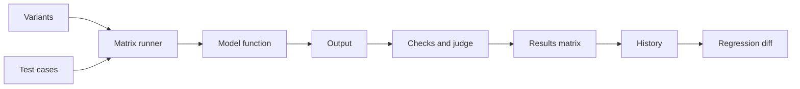

# eval-lab

Compare prompt variants against test cases and catch regressions between runs.

- Prompt variants against test cases with deterministic checks and an LLM judge
- Animated results matrix with pass rates and a best-variant badge
- Regression detection between runs
- Side by side output diff and cost estimates
- Offline demo model

## Try it

[](https://vercel.com/new/clone?repository-url=https%3A%2F%2Fgithub.com%2Fedgeorgie%2Feval-lab)

```bash
npm install
npm run dev
```

Open http://localhost:3000. Requires Node 22 or newer.

1. Edit the variants and test cases, or keep the sample suite.
2. Press Run. The demo model needs no key.
3. Click a cell for details, compare two variants, or export the run.

## Configuration

No environment variables. API keys are entered in the app and stay in the browser.

## How it works



The page calls the runner with the suite and a model function. Cells stream into the matrix. A finished run is compared with the previous one and saved in localStorage. Full diagrams and the module map are in [docs/architecture.md](docs/architecture.md).

## Key concepts

| Term | Meaning |
|---|---|
| Variant | A prompt template with an {{input}} placeholder. |
| Test case | An input with one or more checks. |
| Check | A pass or fail rule: contains, not contains, regex, valid JSON, max words or judge. |
| LLM judge | A model call that answers yes or no to a criterion about an output. |
| Regression | A cell that passed in the previous run and fails now. |
| Cell | One variant run on one case. |

## Design system

Typography: Display, Bricolage Grotesque; Text, Figtree; Code, JetBrains Mono.

| Token | Value | Use |
|---|---|---|
| `canvas` | `#f6f5f1` | Page background |
| `ink` | `#101216` | Text |
| `brand` | `#3b4cff` | Primary action |
| `pass` | `#0f9d6b` | Passed checks |
| `fail` | `#e5484d` | Failed checks |
| `warn` | `#f5a524` | Mid pass rate |

- Color carries meaning: green passes, red fails.
- Show the evidence: one click from any cell to the raw output.

Motion, components and rationale: [docs/design-system.md](docs/design-system.md).

## Data flow and privacy

| Data | Where it goes | Stored |
|---|---|---|
| Prompts and cases | Browser; saved locally | localStorage |
| Prompts and outputs | Sent to the chosen provider when not in demo mode | Not stored |
| Provider key | localStorage, sent only to the provider | This browser |
| Run history | Last runs kept locally | localStorage |

## Limits

- Judge checks add model calls and cost.
- Price estimates use rough list prices and must be rechecked.
- Up to four variants.

## Documentation

| Document | What it answers |
|---|---|
| [docs/index.md](docs/index.md) | Map of all documentation |
| [docs/architecture.md](docs/architecture.md) | Diagrams and modules |
| [docs/spec/spec.md](docs/spec/spec.md) | Requirements and acceptance criteria |
| [docs/spec/traceability.md](docs/spec/traceability.md) | Requirement to code, test and evidence |
| [docs/design-system.md](docs/design-system.md) | Tokens, motion, components |
| [docs/glossary.md](docs/glossary.md) | Definitions |
| [docs/evaluation.md](docs/evaluation.md) | Self-assessment against a review rubric |
| [docs/adr](docs/adr) | Decision records |

## For AI agents and tools

- [AGENTS.md](AGENTS.md) defines the workflow and quality gates for agents and people.
- [llms.txt](public/llms.txt) is served at `/llms.txt` when deployed and points to the key documents.
- [docs/spec/requirements.json](docs/spec/requirements.json) is the machine-readable requirement list with status, files and tests.
- `npm run verify` is the single deterministic gate: typecheck, lint, traceability check, tests and build.

LLM integration: The judge model reads outputs it is grading, so an output can try to influence its own grade. The judge answers one word, which limits the surface, and deterministic checks run first.

## Scripts

| Script | Purpose |
|---|---|
| `npm run dev` | Development server |
| `npm run build` | Production build |
| `npm run typecheck` | TypeScript check |
| `npm run lint` | ESLint |
| `npm test` | Unit tests |
| `npm run spec:check` | Traceability gate |
| `npm run verify` | All of the above |

## Contributing

See [CONTRIBUTING.md](CONTRIBUTING.md). Security reports: [SECURITY.md](SECURITY.md).

## License

MIT.
