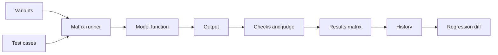
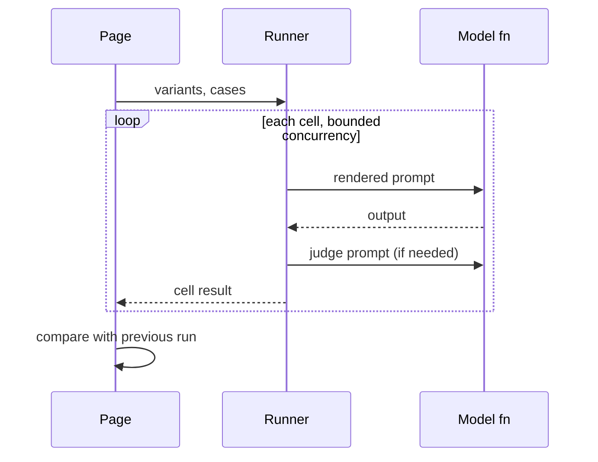

# Architecture

## Data flow

## Main sequence

## Modules

| Path | Responsibility |
|---|---|
| `lib/assert.ts` | Checks and judge helpers |
| `lib/runner.ts` | Matrix execution |
| `lib/history.ts` | Summaries and run diffs |
| `lib/diff.ts` | Word diff |
| `lib/cost.ts` | Estimates |
| `lib/demo.ts` | Offline model and sample suite |
| `components/` | Matrix, ring, drawer, editors |

## Principles

- Pure logic lives in `lib/` and is tested without a browser; components stay thin.
- Network, storage and model replies are validated at the boundary.
- Secrets and user content stay in the browser.

## Decisions

- [Model function injected into the runner](adr/0001-model-function-injected-into-the-runner.md)
